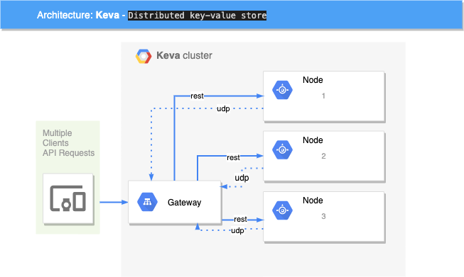

Keva
============
Distributed key-value store

# General



# Demo

## Start the server

```
docker-compose up --build
```

## Insert data

```
curl -XPOST http://localhost:5555/storage/test1 -d "hello world"
```

## Read data

```
curl -XGET http://localhost:5555/storage/test1 
```

## Update data

```
curl -XPUT http://localhost:5555/storage/test1 -d "hi world"
```

## Delete data

```
curl -XDELETE http://localhost:5555/storage/test1
```